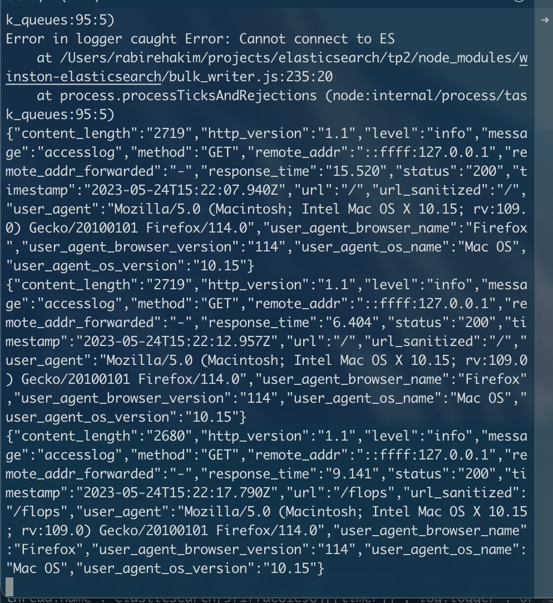

## API REST

J'ai créé une API REST en node.js avec express qui communique avec elasticsearch

Emdpoints :

- GET `/films/` retoune tout les films
- GET `/films/flops` retourne tout les films qui ont floppés
- GET `/reports/search` recherche en annalisant dans tout les avis
- PUT `/report` Soummet un avis pour l'`IT classroom`


## Logger

J'ai configuré un logger qui garde une trace de toutes les interactions de mon API avec eslasticsearch.



Les librairies permettant cela sont winston et morgan.

Je ne suis pas en mesure pour l'instant de consulter ces logs sur Kibana mais j'arrive à consulter les logs dans la console.

## Analyser

D'abord, je créé un analyser afin de pouvoir l'utiliser dans mon controller node js :

```
POST /reports/_close

PUT /reports/_settings
{
  "analysis": {
    "analyzer": {
      "custom_analyzer": {
        "type": "custom",
        "tokenizer": "standard",
        "filter": ["lowercase"]
      }
    }
  }
}

POST /reports/_open
```

Je peux maintenant faire des recherches en passant a travers le process d'analyse que je viens de créer


