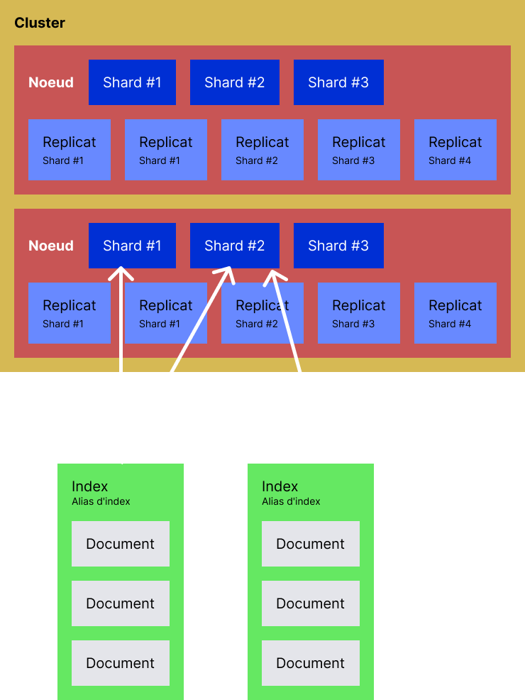
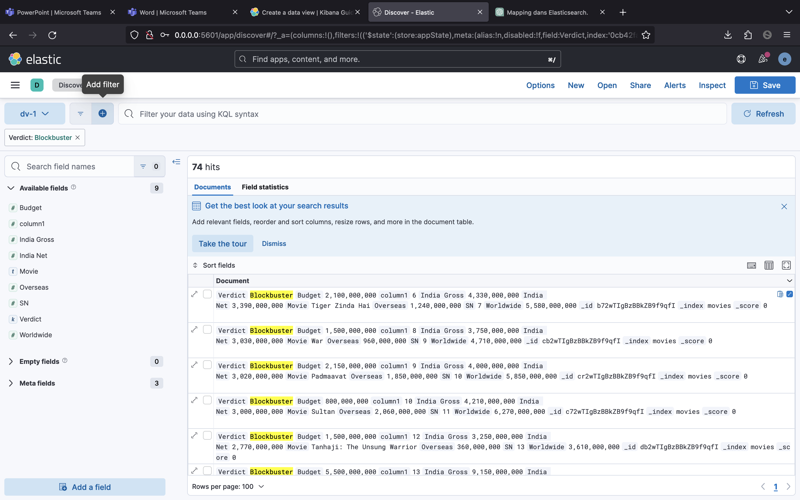
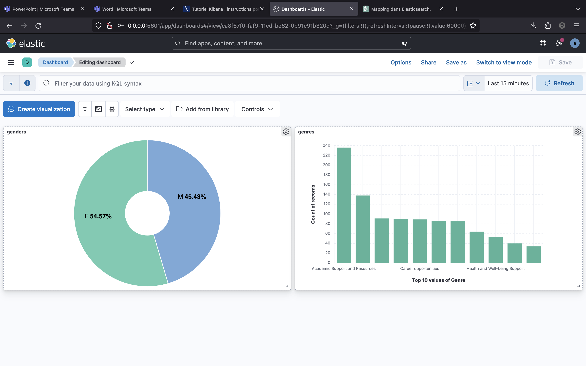

## A. Schéma

> Les éléments suivants permettent de gagner en robustesse:

`Sharding` : Processus qui partitionne les données d'un index en plusieurs shards. Chaque shard contient une partie des données de l'index. Ils sont répartis sur les nœuds du cluster, ce qui permet la parallélisation des opérations.

`Réplica` : Copies des shards. Chaque shard primaire a un ou plusieurs réplicas. Ils permettent la redondance des données interviennent pour secourir les nœuds ou shard indisponibles.

`Alias d'index` : Nom symbolique qui peut être utilisé pour faire référence à un ou plusieurs index. Les alias facilitent les opérations.

`Nœud` : Instance d'exécution d'Elasticsearch. Chaque nœud héberge un ou plusieurs shards et participe au traitement des requêtes, à l'indexation des données et à la recherche. Les nœuds communiquent entre eux pour partager les données, coordonner les opérations et assurer la cohérence du cluster.

> Mise à l’échelle

Les fonctionnalités de mise à l'échelle d'Elasticsearch permettent de faire évoluer le système pour gérer des volumes de données plus importants et pour répondre à une charge de requêtes grande. Ca doit bien fonctionner avec kubernetes.

## B. Scroll API

L'outil Scroll API d'Elasticsearch permet de récupérer de grands ensembles de résultats à partir d'une seule requête de recherche en utilisant une approche de pagination continue. Elle n'est pas recommandée pour faire de la pagination sur les listes de plus de 10 000 éléments.

## C. Kibana

> Quel est l’usage principal de Kibana ?

Kibana est un outil de visualisation, de manipulations et d'analyse de données d'Elasticsearch à l'aide d'un UI.

> Qu’est-ce qu’un Dashboard ?

Vue qui rassemble des graphiques basés sur des filtres de données.

> Créer une data view

> Explorer les données (Discover)

> Créer deux visualisations

> Créer un dashboard

